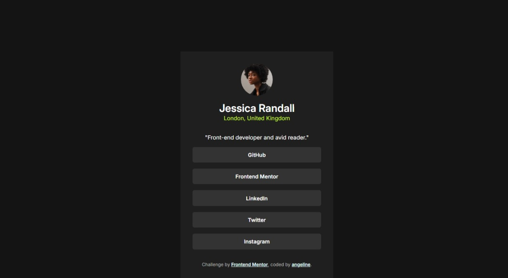
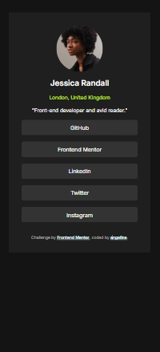
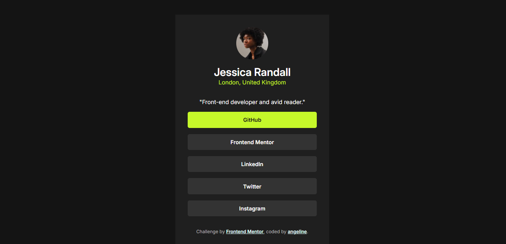

# Frontend Mentor - Social links profile solution

This is a solution to the [Social links profile challenge on Frontend Mentor](https://www.frontendmentor.io/challenges/social-links-profile-UG32l9m6dQ). Furthermore, this simple solution is developed using HTML and CSS.

## Table of contents

- [Overview](#overview)
  - [The challenge](#the-challenge)
  - [Screenshot](#screenshot)
  - [Links](#links)
- [Author](#author)

## Overview

### The challenge

Users should be able to:

- See hover and focus states for all interactive elements on the page

### Screenshot

  
  

### Links
- Live Site URL: [https://angelineds.github.io/social-media-profile](https://angelineds.github.io/social-media-profile/)

## Other Projects

- Portfolio Website - [angeline-portfolio.netlify.app](https://angeline-portfolio.netlify.app)
